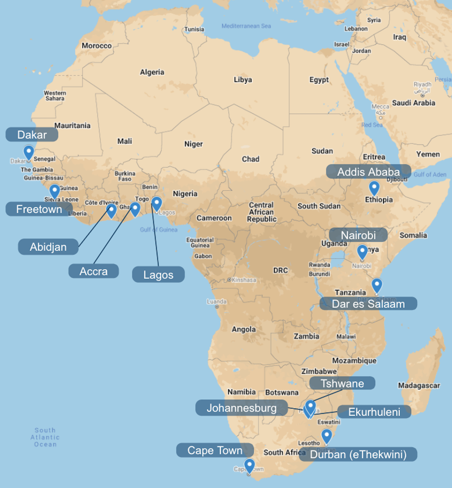

**Environmental Health Sciences Capstone, Spring 2021**  
**C40 Cities Climate Leadership Group**  
Jaron Burke, Shannon Park, Jamie Ponmattam, Nalyn Siripanichgon  

 

## Motivation

C40’s Air Quality Program works at the nexus of air pollution and climate change by helping cities accelerate reductions in air pollutants and greenhouse gases through robust air quality management efforts. African cities are among those most impacted by air pollution, but currently lack sufficient air quality data due to minimal continuous air quality monitoring networks. Currently there are 13 Sub-Saharan African cities in C40’s network: Accra, Abidjan, Addis Ababa, Cape Town, Dakar, Dar es Salaam, Ekurhuleni, eThekwini (Durban), Freetown, Johannesburg, Lagos, Nairobi, and Tshwane. Focusing on these cities, this project will provide a comprehensive review of existing air pollution information and data within the context in each city.

Drawing on the information and data gathered in this review, the project will aim to provide insights on current air pollution levels and source apportionment, local health impacts of air pollution, and existing air quality policies and monitoring systems. By capturing the current context of air pollution in C40 African cities, these insights can be used to identify where interventions are needed. The C40 AQ Team will share all findings of this project with cities to motivate local actions to reduce air pollution and improve air quality monitoring networks.

## Objectives

* Provide knowledge for each city, including: 
- Current air pollution levels  
- Current health impacts  
- Status of AQ management  
- Existing policy options  
* Improve air quality management practices and reduce air pollution

## Deliverables 

* Policy Matrix
* Air pollution summary matrix
* 13 City Summaries
* Interactive Air Pollution Map

